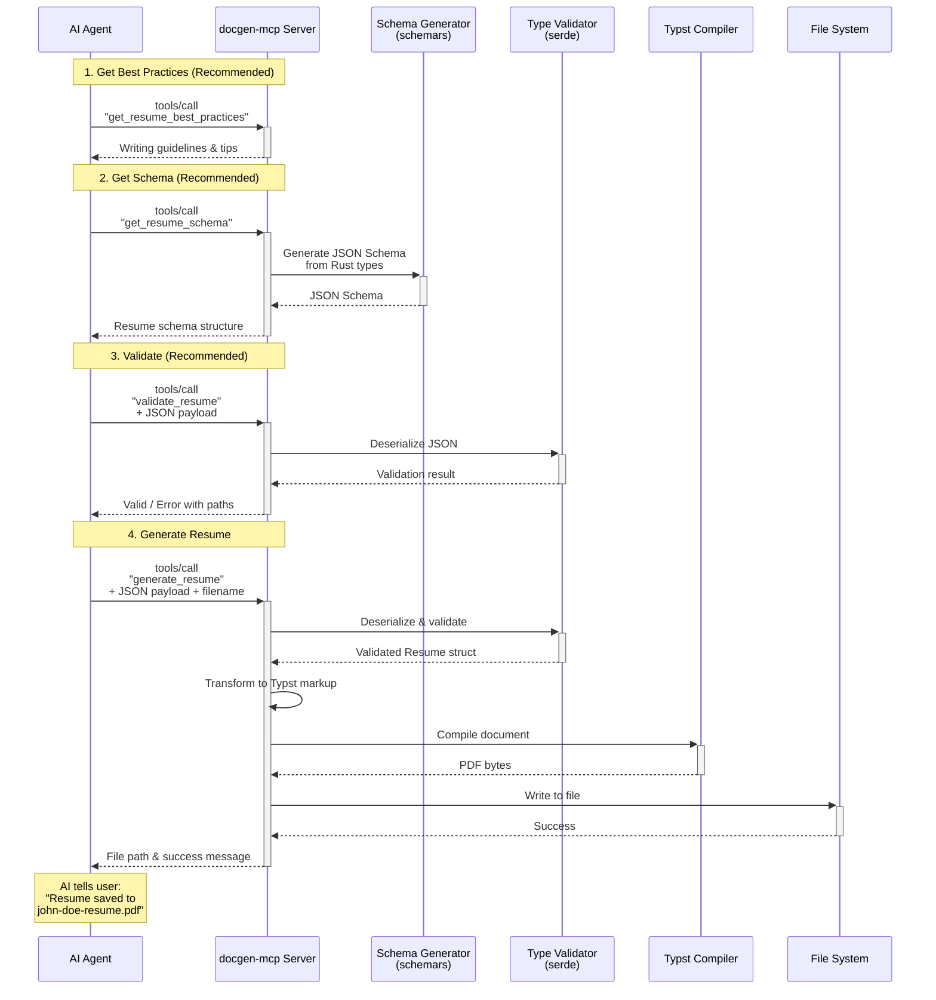

# docgen-mcp

A type-safe document generation framework for AI agents, powered by [Typst](https://typst.app) and the Model Context Protocol (MCP). Generate professional resumes, cover letters, and more through structured JSON with automatic validation and PDF compilation.

## Overview

docgen-mcp is a **code-first document generation framework** that makes it easy for AI agents to create professionally formatted documents:

- **Type-Safe** — Document structures defined as Rust types with automatic JSON Schema generation
- **AI-Optimized** — Discovery tools, best practices prompts, and sandbox-aware file handling
- **Professional Output** — Typst-powered PDF generation with production-quality templates
- **Extensible** — Add new document types by defining Rust types and Typst templates

### Document Types

- ✅ **Resume** — 1-2 page professional summary (industry standard in North America)
- ✅ **Cover Letter** — One-page personalized application letter
- 🔲 **CV** — Comprehensive academic/research document (planned)



## Features

- **Type-safe** — Document structures defined as Rust types with `schemars` for JSON Schema generation
- **Code-first** — Single source of truth in Rust types, no schema drift
- **Extensible** — Add new document types by defining Rust types and Typst templates
- **Embedded compiler** — No external Typst installation required; compiler runs in-process
- **Dual transport** — Supports both HTTP/SSE (Claude.ai remote) and stdio (Claude Desktop local)

## Quick Start

### Local Development

```bash
# Clone and build
git clone https://github.com/yourname/docgen-mcp
cd docgen-mcp
cargo build --release

# Run the MCP server locally
# (Supports both stdio and HTTP/SSE transports)
./target/release/docgen-mcp
```

### Production Deployment (Railway)

1. Push your repository to GitHub
2. Create a new project on [Railway](https://railway.app)
3. Connect your GitHub repository
4. Railway will automatically detect the Rust project and build it
5. Configure the public domain in Railway settings
6. Copy the URL for use in Claude.ai

### MCP Configuration

**For Claude.ai (Remote MCP - Recommended):**

Available on Pro, Max, Team, and Enterprise plans.

1. Navigate to Settings > Connectors in Claude.ai
2. Select "Add custom connector"
3. Enter your Railway deployment URL (e.g., `https://your-app.railway.app`)
4. Optionally configure OAuth for authentication
5. Review and enable the tools you want to use

**For Claude Desktop (Local):**

Add to your Claude Desktop config (`claude_desktop_config.json`):

```json
{
  "mcpServers": {
    "docgen": {
      "command": "/path/to/docgen-mcp"
    }
  }
}
```

Note: Claude Desktop uses stdio transport, while Claude.ai uses HTTP/SSE transport.

## MCP Interface

### Resources

| URI | Description |
|-----|-------------|
| `docgen://schemas/resume` | JSON Schema for resume documents |
| `docgen://schemas/cover-letter` | JSON Schema for cover letter documents |

### Prompts

| Name | Description |
|------|-------------|
| `resume-best-practices` | Guidelines for writing effective resume content |
| `cover-letter-best-practices` | Guidelines for writing compelling cover letters |
| `document-type-guide` | Guide to choosing between resume, CV, and cover letter |

### Tools

#### Document Type Discovery

| Name | Description |
|------|-------------|
| `get_document_types` | Returns information about all available document types (resume, cover letter, CV). **Call this FIRST** to understand which document type fits the user's needs. |
| `get_document_type_guide` | Returns comprehensive guide explaining differences between document types with decision trees and workflows. |

#### Resume Tools

| Name | Description |
|------|-------------|
| `get_resume_schema` | Returns the complete JSON Schema for resume documents |
| `get_resume_best_practices` | Returns comprehensive resume writing guidelines |
| `validate_resume` | Validates a resume JSON payload against the schema |
| `generate_resume` | Generates a PDF resume from JSON payload (accepts optional `filename` parameter) |

#### Cover Letter Tools

| Name | Description |
|------|-------------|
| `get_cover_letter_schema` | Returns the complete JSON Schema for cover letter documents |
| `get_cover_letter_best_practices` | Returns comprehensive cover letter writing guidelines |
| `validate_cover_letter` | Validates a cover letter JSON payload against the schema |
| `generate_cover_letter` | Generates a PDF cover letter from JSON payload (accepts optional `filename` parameter) |

**Recommended Workflow for AI Agents:**

1. **Discover** — Call `get_document_types` to understand which document(s) the user needs
2. **Learn** — Call the appropriate `get_X_best_practices` tool to understand content guidelines
3. **Structure** — Call `get_X_schema` to see the expected JSON structure
4. **Gather** — Collect information from the user and construct the JSON
5. **Validate** — Call `validate_X` to check the structure before generating
6. **Generate** — Call `generate_X` to create the PDF file

**Note on Sandbox Environments:**
Generated PDFs return either a file path (local mode) or a download URL (remote mode). AI agents running in sandboxed environments should provide the URL to users rather than attempting to access files directly.

## Project Structure

```
docgen-mcp/
├── Cargo.toml
├── src/
│   ├── main.rs              # Entry point, MCP server setup (HTTP/SSE + stdio)
│   ├── mcp/
│   │   ├── mod.rs
│   │   ├── resources.rs     # Schema resource handlers (serves generated schemas)
│   │   ├── prompts.rs       # Best practices prompts
│   │   └── tools.rs         # Generate/validate tool handlers
│   ├── documents/
│   │   ├── mod.rs
│   │   └── resume.rs        # Resume types (Deserialize + Serialize + JsonSchema)
│   ├── typst/
│   │   ├── mod.rs
│   │   ├── world.rs         # Typst World trait implementation
│   │   ├── compiler.rs      # Compilation orchestration
│   │   └── transform.rs     # Rust types → Typst markup codegen
├── templates/
│   └── resume.typ           # Typst template (embedded at compile time)
└── tests/
    ├── integration.rs
    └── fixtures/
        └── sample_resume.json
```

**Note:** Schemas are generated at runtime from Rust types using `schemars`, eliminating the need for separate JSON Schema files.

## Architecture

### Transport Layers

**Remote (Claude.ai):** HTTP/SSE transport for cloud deployment
**Local (Claude Desktop):** stdio transport for local subprocess communication

### Data Flow

**Recommended Workflow:**
1. **Best Practices** — AI agent calls `get_resume_best_practices` tool to understand guidelines
2. **Schema Discovery** — AI agent calls `get_resume_schema` tool to see the JSON structure
3. **Content Creation** — AI agent gathers info from user and constructs JSON matching the schema
4. **Validation** — AI agent calls `validate_resume` to verify structure before generating
5. **Generation** — AI agent calls `generate_resume` with JSON payload (and optional filename)
6. **Transformation** — Server transforms validated Rust types into Typst markup
7. **Compilation** — Embedded Typst compiler renders the document
8. **File Output** — PDF saved to working directory, file path returned to AI agent

**Alternative (Advanced):** Agents can also directly access MCP resources/prompts:
- RESOURCE `docgen://schemas/resume` for schema
- PROMPT `resume-best-practices` for guidelines

**Why Tools Instead of base64?**
- Saves tokens (no 70KB+ base64 strings)
- AI agents can naturally reference the file
- User gets immediate file access
- Better UX overall

### Key Dependencies

| Crate | Purpose |
|-------|---------|
| `rmcp` | MCP server implementation (official SDK) |
| `axum` | HTTP server framework (for remote MCP) |
| `typst` | Document compiler (embedded) |
| `typst-pdf` | PDF export |
| `typst-kit` | Helpers for World implementation |
| `typst-assets` | Bundled fonts |
| `schemars` | JSON Schema generation from Rust types |
| `serde` / `serde_json` | Serialization |
| `tokio` | Async runtime |

### Schema Management

This project uses a **code-first** approach to schema management:

```rust
use schemars::JsonSchema;
use serde::{Deserialize, Serialize};

#[derive(Deserialize, Serialize, JsonSchema)]
struct Resume {
    basics: Basics,
    work: Vec<WorkExperience>,
    // ...
}
```

**Benefits:**
- Single source of truth (Rust types)
- No drift between schema and types
- Compile-time type safety
- JSON Schema generated programmatically via `schemars`
- Similar to Pydantic's approach (types as contract)

The generated JSON Schema is exposed via the `docgen://schemas/resume` resource for MCP clients to discover and validate against.

---

## Milestones

### Milestone 0: Project Scaffolding ✅
> *Get the skeleton compiling and running with dual transport support*

- [x] Initialize Cargo workspace
- [x] Add core dependencies (`rmcp` with `server` and `axum` features, `tokio`, `serde`, `serde_json`)
- [x] Create minimal MCP server with stdio transport (Claude Desktop)
- [x] Add HTTP/SSE transport using Axum (Claude.ai remote)
- [x] Server responds to `initialize` on both transports
- [x] Set up basic project structure (directories, mod.rs files)
- [x] Add CI workflow (cargo check, clippy, test)

**Deliverable:** Server completes MCP handshake via both stdio and HTTP/SSE transports ✅

**Implementation Notes:**
- Used `cargo add` for automatic version resolution
- Implemented `ServerHandler` trait with `get_info()` method providing server metadata
- Stdio mode is default; HTTP activated via `--http` flag or `PORT` env var
- HTTP server uses Streamable HTTP transport (MCP protocol version 2025-03-26)
- HTTP server binds to `0.0.0.0` with configurable port (default: 3000)
- MCP endpoint available at `/mcp` for HTTP mode
- Integration tests verify both stdio and HTTP server startup
- All CI checks passing (cargo check, clippy, test)

**Additional Tasks Identified:**
- [x] Add proper MCP HTTP/SSE endpoints (using Streamable HTTP transport)
- [x] Implement server info metadata (name, version) in ServerHandler
- [x] Add integration tests for MCP protocol handshake

---

### Milestone 1: Schema Resource ✅
> *Define Rust types and expose generated JSON schema as an MCP resource*

- [x] Add `schemars` dependency to Cargo.toml
- [x] Define resume Rust types (start simple: `Basics`, `WorkExperience`, `Education`, `Skills`)
- [x] Derive `Deserialize`, `Serialize`, and `JsonSchema` on types
- [x] Generate JSON Schema at runtime using `schemars::schema_for!`
- [x] Implement MCP `resources/list` handler
- [x] Implement MCP `resources/read` handler for `docgen://schemas/resume`
- [x] Add tests for resource handlers and schema generation

**Deliverable:** Client can read the resume schema via MCP (generated from Rust types) ✅

**Implementation Notes:**
- Resume types defined in `src/documents/resume.rs` with full schemars annotations
- Types include: `Resume`, `Basics`, `Profile`, `WorkExperience`, `Education`, `Skill`
- Free-form `publications` field for flexible publication summaries
- Resources capability enabled via `ServerCapabilities::builder().enable_resources()`
- Schema exposed at `docgen://schemas/resume` URI
- Sample fixture added at `tests/fixtures/sample_resume.json`
- 10 tests covering serialization, deserialization, schema generation, and resource handlers

---

### Milestone 2: Validation Tool ✅
> *Accept JSON payloads and validate via type deserialization*

- [x] Implement `validate_resume` tool
- [x] Use `serde_json::from_value` to deserialize and validate
- [x] Convert serde errors into structured validation errors (path + message)
- [x] Add integration tests with valid/invalid fixtures
- [x] Test edge cases (missing required fields, wrong types, etc.)

**Deliverable:** `validate_resume` tool returns success or detailed serde validation errors ✅

**Implementation Notes:**
- Tool implemented in `src/mcp/tools.rs` with `ValidationResult` enum (Valid/Invalid)
- `ValidationError` struct provides structured errors with `path` and `message` fields
- Serde error parsing extracts field names and infers paths from type context
- Tools capability enabled via `ServerCapabilities::builder().enable_tools()`
- `list_tools` and `call_tool` handlers wired up in `ServerHandler`
- Returns structured JSON response via `CallToolResult::structured()`
- 4 invalid fixture files added for testing edge cases
- 17 tool-related tests covering valid, invalid, and edge cases
- All 28 tests passing (25 unit + 3 integration)

---

### Milestone 3: Typst Integration ✅
> *Compile a minimal Typst document to PDF*

- [x] Add Typst crates (`typst`, `typst-pdf`, `typst-kit`, `typst-assets`)
- [x] Implement `World` trait for in-memory compilation
- [x] Create minimal resume Typst template
- [x] Compile hardcoded content to PDF as proof-of-concept
- [x] Handle font loading (embed via `typst-assets` or bundle subset)

**Deliverable:** Server can produce a PDF from static Typst source ✅

**Implementation Notes:**
- Added `typst`, `typst-pdf`, and `typst-assets` with `fonts` feature enabled
- Implemented `DocgenWorld` using the `typst::World` trait for in-memory compilation
- Created `compile` function in `src/typst/compiler.rs` to orchestrate PDF generation
- Integrated `typst-assets` to provide professional fonts (Libertinus Serif)
- Added `pdf-extract` dev-dependency to verify PDF content in unit tests
- 26 unit tests + 3 integration tests passing

---

### Milestone 4: Resume Generation Tool ✅
> *Full pipeline: JSON → Typst → PDF*

- [x] Transform `Resume` struct into Typst markup string
- [x] Wire up `generate_resume` tool: validate → transform → compile → save
- [x] Save PDF to file and return file path
- [x] Add error handling for compilation failures
- [x] Integration test: sample JSON → valid PDF

**Deliverable:** End-to-end resume generation works ✅

**Implementation Notes:**
- Redesigned `templates/resume.typ` to be a functional, dynamic template
- Implemented professional "Jake Ryan" layout (centered header, small-caps sections, 4-quadrant entries)
- Added `Project` struct to schema and `location` fields to `WorkExperience` and `Education`
- Created `src/typst/transform.rs` to safely inject JSON data into Typst
- Implemented `generate_resume` tool that combines validation, transformation, and compilation
- Changed output from base64 to file-based (saves tokens, better AI agent UX)
- Added optional `filename` parameter with auto-generation from name
- Increased integration test timeouts to handle increased binary size and startup time
- All tests passing ✅

---

### Milestone 5: Best Practices Prompt ✅
> *Guide LLMs toward better resume content*

- [x] Write resume best practices content (concise, actionable)
- [x] Implement MCP `prompts/list` handler
- [x] Implement MCP `prompts/get` handler for `resume-best-practices`
- [x] Include schema reference in prompt for context

**Deliverable:** Clients can request guidance before generating ✅

**Implementation Notes:**
- Created `src/mcp/prompts.rs` with comprehensive resume writing guidelines
- Prompt includes content guidelines (contact info, summary, work experience, education, skills, projects)
- Writing style do's and don'ts (concise, no pronouns, quantify achievements, etc.)
- Full JSON schema embedded in prompt for LLM context
- Schema URI reference for workflow guidance
- Prompts capability enabled via `ServerCapabilities::builder().enable_prompts()`
- `list_prompts` and `get_prompt` handlers wired up in `ServerHandler`
- 5 new prompt-related tests added
- All 40 tests (37 unit + 3 integration) passing ✅

---

### Milestone 6: Template Refinement ✅
> *Professional-quality resume output*

- [x] Design polished Typst template (clean typography, spacing)
- [x] Support multiple sections (projects, certifications, languages, etc.)
- [x] Add optional template variants (classic, modern, minimal)
- [x] Handle edge cases (missing optional fields, long content)

**Deliverable:** Generated resumes look professional ✅

**Implementation Notes:**
- Redesigned template with improved typography (10pt base, 12pt headers, justified text)
- Added helper functions for consistent entry headers (4-quadrant grid layout)
- Added `format-dates` helper for consistent date range formatting
- New sections added to template: Summary, Certifications, Awards, Languages, Publications
- New schema types: `Certification`, `Award`, `Language` with full schemars annotations
- Location now displayed in header below name
- Professional summary displayed as italic text below contact info
- Robust edge case handling with `if` checks for all optional fields
- Education section now supports highlights (coursework, honors)
- Projects section now displays URLs and descriptions
- Current template serves as "classic" variant; additional variants (modern, minimal) can be added via template parameters in Milestone 7
- All 40 tests (37 unit + 3 integration) passing ✅

---

### Milestone 7: Configuration & Customization ✅
> *User control over output*

- [x] ~~Add tool parameters for customization (template variant, accent color, font)~~ — Skipped for opinionated style consistency
- [x] ~~Support page size options (letter, A4)~~ — Skipped for opinionated style consistency
- [x] Allow custom section ordering
- [x] Document configuration options in schema

**Deliverable:** Users can customize section ordering while maintaining consistent professional styling ✅

**Implementation Notes:**
- Added `sectionOrder` field to Resume schema for custom section ordering
- Valid sections: `education`, `experience`, `projects`, `certifications`, `awards`, `publications`, `skills`, `languages`
- Default order used when `sectionOrder` is not specified
- Omit sections from the list to hide them entirely
- Refactored template with section renderer functions for dynamic ordering
- Template uses section dispatcher pattern for clean, maintainable code
- Skipped style customization (colors, fonts, page size) intentionally for consistent professional output
- Schema descriptions document all configuration options
- All 41 tests (38 unit + 3 integration) passing ✅

---

### Milestone 8: AI Agent UX Optimization ✅
> *Make the server work great with ANY AI agent*

- [x] Add convenience tools wrapping resources/prompts for discoverability
- [x] Implement `get_resume_schema` tool (wraps resource)
- [x] Implement `get_resume_best_practices` tool (wraps prompt)
- [x] Update server instructions to guide AI agents through recommended workflow
- [x] Change PDF output from base64 to file-based (token efficiency)
- [x] Add optional `filename` parameter to `generate_resume`
- [x] Update tool descriptions to reference workflow steps
- [x] Add tests for new tools and file output

**Deliverable:** Server optimized for AI agent discovery and usage ✅

**Implementation Notes:**
- Added `get_resume_schema` and `get_resume_best_practices` as discoverable tools
- These wrap existing resources/prompts, providing both semantic MCP structure AND pragmatic discoverability
- Server instructions now explicitly guide AI agents through 5-step workflow
- Changed `generate_resume` output from base64-encoded PDF to file path
  - Saves 70KB+ tokens per resume
  - AI agents can naturally reference files
  - Better user experience
- Auto-generates filename from resume name if not provided
- Updated all tool descriptions to cross-reference and guide workflow
- All 48 tests (45 unit + 3 integration) passing ✅

**Design Philosophy:**
- "Pit of success" - Server should work well regardless of AI agent quality
- Discoverable - Critical features exposed as tools that agents naturally find
- Token efficient - File output instead of base64
- Guided - Instructions and descriptions lead agents to best practices

---

### Milestone 9: Polish & Release
> *Production-ready*

- [ ] Comprehensive error messages
- [ ] Logging with `tracing`
- [ ] Performance optimization (cache compiled fonts, reuse compiler state)
- [ ] Documentation (README, rustdoc, examples)
- [ ] Release binaries for major platforms
- [ ] Publish to crates.io (optional)

**Deliverable:** v1.0 release

---

## Future Ideas

- **Additional document types** — CVs (academic), invoices, reports, proposals, case studies
- **Template marketplace** — Load custom Typst templates at runtime
- **Multi-format export** — HTML, PNG, DOCX beyond PDF
- **Streaming compilation** — For very large documents
- **WASM build** — Run in browser environments
- **Template customization** — User-selectable themes, colors, fonts

## Development

```bash
# Run tests
cargo test

# Run with debug logging
RUST_LOG=debug cargo run

# Format and lint
cargo fmt
cargo clippy
```

## License

MIT OR Apache-2.0

## Acknowledgments

- [Typst](https://typst.app) — The incredible typesetting system at the core
- [MCP](https://modelcontextprotocol.io) — Protocol enabling AI-tool integration
- [JSON Resume](https://jsonresume.org) — Inspiration for the resume schema structure
