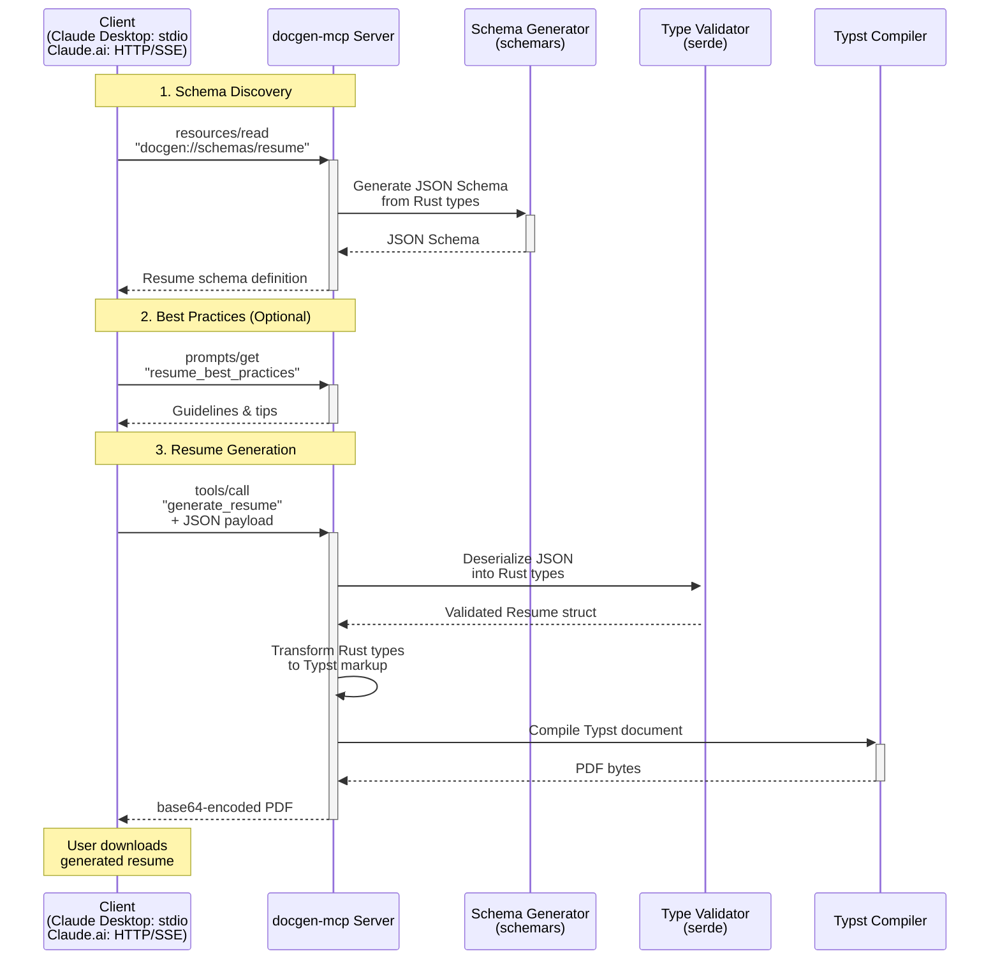

# docgen-mcp

A Model Context Protocol (MCP) server for programmatic document generation, powered by [Typst](https://typst.app). Currently focused on resume/CV generation with plans to expand to other document types.

## Overview

docgen-mcp provides a structured approach to document generation through MCP:

- **Resources** — Exposes JSON schemas describing the structure of each document type
- **Prompts** — Best practices and guidelines for creating effective documents
- **Tools** — Validates payloads against schemas and generates typeset PDFs



## Features

- **Type-safe** — Document structures defined as Rust types with `schemars` for JSON Schema generation
- **Code-first** — Single source of truth in Rust types, no schema drift
- **Extensible** — Add new document types by defining Rust types and Typst templates
- **Embedded compiler** — No external Typst installation required; compiler runs in-process
- **Dual transport** — Supports both HTTP/SSE (Claude.ai remote) and stdio (Claude Desktop local)

## Quick Start

### Local Development

```bash
# Clone and build
git clone https://github.com/yourname/docgen-mcp
cd docgen-mcp
cargo build --release

# Run the MCP server locally
# (Supports both stdio and HTTP/SSE transports)
./target/release/docgen-mcp
```

### Production Deployment (Railway)

1. Push your repository to GitHub
2. Create a new project on [Railway](https://railway.app)
3. Connect your GitHub repository
4. Railway will automatically detect the Rust project and build it
5. Configure the public domain in Railway settings
6. Copy the URL for use in Claude.ai

### MCP Configuration

**For Claude.ai (Remote MCP - Recommended):**

Available on Pro, Max, Team, and Enterprise plans.

1. Navigate to Settings > Connectors in Claude.ai
2. Select "Add custom connector"
3. Enter your Railway deployment URL (e.g., `https://your-app.railway.app`)
4. Optionally configure OAuth for authentication
5. Review and enable the tools you want to use

**For Claude Desktop (Local):**

Add to your Claude Desktop config (`claude_desktop_config.json`):

```json
{
  "mcpServers": {
    "docgen": {
      "command": "/path/to/docgen-mcp"
    }
  }
}
```

Note: Claude Desktop uses stdio transport, while Claude.ai uses HTTP/SSE transport.

## MCP Interface

### Resources

| URI | Description |
|-----|-------------|
| `docgen://schemas/resume` | JSON Schema for resume documents |

Example schema (simplified):

```json
{
  "$schema": "http://json-schema.org/draft-07/schema#",
  "title": "Resume",
  "type": "object",
  "required": ["basics", "work"],
  "properties": {
    "basics": {
      "type": "object",
      "required": ["name", "email"],
      "properties": {
        "name": { "type": "string" },
        "email": { "type": "string", "format": "email" },
        "phone": { "type": "string" },
        "location": { "type": "string" },
        "summary": { "type": "string" },
        "profiles": {
          "type": "array",
          "items": {
            "type": "object",
            "properties": {
              "network": { "type": "string" },
              "url": { "type": "string", "format": "uri" }
            }
          }
        }
      }
    },
    "work": {
      "type": "array",
      "items": {
        "type": "object",
        "required": ["company", "position"],
        "properties": {
          "company": { "type": "string" },
          "position": { "type": "string" },
          "startDate": { "type": "string", "format": "date" },
          "endDate": { "type": "string" },
          "highlights": { "type": "array", "items": { "type": "string" } }
        }
      }
    },
    "education": { "type": "array" },
    "skills": { "type": "array" },
    "publications": { "type": "string", "description": "Free-form text describing publications" }
  }
}
```

### Prompts

| Name | Description |
|------|-------------|
| `resume-best-practices` | Guidelines for writing effective resume content |

### Tools

| Name | Description |
|------|-------------|
| `generate_resume` | Accepts a JSON payload conforming to the resume schema, returns a PDF |
| `validate_resume` | Validates a payload against the schema without generating |

## Project Structure

```
docgen-mcp/
├── Cargo.toml
├── src/
│   ├── main.rs              # Entry point, MCP server setup (HTTP/SSE + stdio)
│   ├── mcp/
│   │   ├── mod.rs
│   │   ├── resources.rs     # Schema resource handlers (serves generated schemas)
│   │   ├── prompts.rs       # Best practices prompts
│   │   └── tools.rs         # Generate/validate tool handlers
│   ├── documents/
│   │   ├── mod.rs
│   │   └── resume.rs        # Resume types (Deserialize + Serialize + JsonSchema)
│   ├── typst/
│   │   ├── mod.rs
│   │   ├── world.rs         # Typst World trait implementation
│   │   ├── compiler.rs      # Compilation orchestration
│   │   └── transform.rs     # Rust types → Typst markup codegen
├── templates/
│   └── resume.typ           # Typst template (embedded at compile time)
└── tests/
    ├── integration.rs
    └── fixtures/
        └── sample_resume.json
```

**Note:** Schemas are generated at runtime from Rust types using `schemars`, eliminating the need for separate JSON Schema files.

## Architecture

### Transport Layers

**Remote (Claude.ai):** HTTP/SSE transport for cloud deployment
**Local (Claude Desktop):** stdio transport for local subprocess communication

### Data Flow

1. **Schema Discovery** — Client reads `docgen://schemas/resume` to understand the expected structure
2. **Content Creation** — Client (often an LLM) constructs JSON matching the schema
3. **Validation** — Server validates payload by deserializing into Rust types (via serde)
4. **Transformation** — Validated Rust types are transformed into Typst markup
5. **Compilation** — Embedded Typst compiler renders the document
6. **Output** — PDF bytes returned to client (base64-encoded in MCP response)

### Key Dependencies

| Crate | Purpose |
|-------|---------|
| `rmcp` | MCP server implementation (official SDK) |
| `axum` | HTTP server framework (for remote MCP) |
| `typst` | Document compiler (embedded) |
| `typst-pdf` | PDF export |
| `typst-kit` | Helpers for World implementation |
| `typst-assets` | Bundled fonts |
| `schemars` | JSON Schema generation from Rust types |
| `serde` / `serde_json` | Serialization |
| `tokio` | Async runtime |

### Schema Management

This project uses a **code-first** approach to schema management:

```rust
use schemars::JsonSchema;
use serde::{Deserialize, Serialize};

#[derive(Deserialize, Serialize, JsonSchema)]
struct Resume {
    basics: Basics,
    work: Vec<WorkExperience>,
    // ...
}
```

**Benefits:**
- Single source of truth (Rust types)
- No drift between schema and types
- Compile-time type safety
- JSON Schema generated programmatically via `schemars`
- Similar to Pydantic's approach (types as contract)

The generated JSON Schema is exposed via the `docgen://schemas/resume` resource for MCP clients to discover and validate against.

---

## Milestones

### Milestone 0: Project Scaffolding ✅
> *Get the skeleton compiling and running with dual transport support*

- [x] Initialize Cargo workspace
- [x] Add core dependencies (`rmcp` with `server` and `axum` features, `tokio`, `serde`, `serde_json`)
- [x] Create minimal MCP server with stdio transport (Claude Desktop)
- [x] Add HTTP/SSE transport using Axum (Claude.ai remote)
- [x] Server responds to `initialize` on both transports
- [x] Set up basic project structure (directories, mod.rs files)
- [x] Add CI workflow (cargo check, clippy, test)

**Deliverable:** Server completes MCP handshake via both stdio and HTTP/SSE transports ✅

**Implementation Notes:**
- Used `cargo add` for automatic version resolution
- Implemented `ServerHandler` trait with `get_info()` method providing server metadata
- Stdio mode is default; HTTP activated via `--http` flag or `PORT` env var
- HTTP server uses Streamable HTTP transport (MCP protocol version 2025-03-26)
- HTTP server binds to `0.0.0.0` with configurable port (default: 3000)
- MCP endpoint available at `/mcp` for HTTP mode
- Integration tests verify both stdio and HTTP server startup
- All CI checks passing (cargo check, clippy, test)

**Additional Tasks Identified:**
- [x] Add proper MCP HTTP/SSE endpoints (using Streamable HTTP transport)
- [x] Implement server info metadata (name, version) in ServerHandler
- [x] Add integration tests for MCP protocol handshake

---

### Milestone 1: Schema Resource ✅
> *Define Rust types and expose generated JSON schema as an MCP resource*

- [x] Add `schemars` dependency to Cargo.toml
- [x] Define resume Rust types (start simple: `Basics`, `WorkExperience`, `Education`, `Skills`)
- [x] Derive `Deserialize`, `Serialize`, and `JsonSchema` on types
- [x] Generate JSON Schema at runtime using `schemars::schema_for!`
- [x] Implement MCP `resources/list` handler
- [x] Implement MCP `resources/read` handler for `docgen://schemas/resume`
- [x] Add tests for resource handlers and schema generation

**Deliverable:** Client can read the resume schema via MCP (generated from Rust types) ✅

**Implementation Notes:**
- Resume types defined in `src/documents/resume.rs` with full schemars annotations
- Types include: `Resume`, `Basics`, `Profile`, `WorkExperience`, `Education`, `Skill`
- Free-form `publications` field for flexible publication summaries
- Resources capability enabled via `ServerCapabilities::builder().enable_resources()`
- Schema exposed at `docgen://schemas/resume` URI
- Sample fixture added at `tests/fixtures/sample_resume.json`
- 10 tests covering serialization, deserialization, schema generation, and resource handlers

---

### Milestone 2: Validation Tool ✅
> *Accept JSON payloads and validate via type deserialization*

- [x] Implement `validate_resume` tool
- [x] Use `serde_json::from_value` to deserialize and validate
- [x] Convert serde errors into structured validation errors (path + message)
- [x] Add integration tests with valid/invalid fixtures
- [x] Test edge cases (missing required fields, wrong types, etc.)

**Deliverable:** `validate_resume` tool returns success or detailed serde validation errors ✅

**Implementation Notes:**
- Tool implemented in `src/mcp/tools.rs` with `ValidationResult` enum (Valid/Invalid)
- `ValidationError` struct provides structured errors with `path` and `message` fields
- Serde error parsing extracts field names and infers paths from type context
- Tools capability enabled via `ServerCapabilities::builder().enable_tools()`
- `list_tools` and `call_tool` handlers wired up in `ServerHandler`
- Returns structured JSON response via `CallToolResult::structured()`
- 4 invalid fixture files added for testing edge cases
- 17 tool-related tests covering valid, invalid, and edge cases
- All 28 tests passing (25 unit + 3 integration)

---

### Milestone 3: Typst Integration ✅
> *Compile a minimal Typst document to PDF*

- [x] Add Typst crates (`typst`, `typst-pdf`, `typst-kit`, `typst-assets`)
- [x] Implement `World` trait for in-memory compilation
- [x] Create minimal resume Typst template
- [x] Compile hardcoded content to PDF as proof-of-concept
- [x] Handle font loading (embed via `typst-assets` or bundle subset)

**Deliverable:** Server can produce a PDF from static Typst source ✅

---

### Milestone 4: Resume Generation Tool ✅
> *Full pipeline: JSON → Typst → PDF*

- [x] Transform `Resume` struct into Typst markup string
- [x] Wire up `generate_resume` tool: validate → transform → compile → encode
- [x] Return PDF as base64 in tool response
- [x] Add error handling for compilation failures
- [x] Integration test: sample JSON → valid PDF

**Deliverable:** End-to-end resume generation works ✅

---

### Milestone 5: Best Practices Prompt
> *Guide LLMs toward better resume content*

- [ ] Write resume best practices content (concise, actionable)
- [ ] Implement MCP `prompts/list` handler
- [ ] Implement MCP `prompts/get` handler for `resume-best-practices`
- [ ] Include schema reference in prompt for context

**Deliverable:** Clients can request guidance before generating

---

### Milestone 6: Template Refinement
> *Professional-quality resume output*

- [ ] Design polished Typst template (clean typography, spacing)
- [ ] Support multiple sections (projects, certifications, languages, etc.)
- [ ] Add optional template variants (classic, modern, minimal)
- [ ] Handle edge cases (missing optional fields, long content)

**Deliverable:** Generated resumes look professional

---

### Milestone 7: Configuration & Customization
> *User control over output*

- [ ] Add tool parameters for customization (template variant, accent color, font)
- [ ] Support page size options (letter, A4)
- [ ] Allow custom section ordering
- [ ] Document configuration options in schema

**Deliverable:** Users can customize output appearance

---

### Milestone 8: Polish & Release
> *Production-ready*

- [ ] Comprehensive error messages
- [ ] Logging with `tracing`
- [ ] Performance optimization (cache compiled fonts, reuse compiler state)
- [ ] Documentation (README, rustdoc, examples)
- [ ] Release binaries for major platforms
- [ ] Publish to crates.io (optional)

**Deliverable:** v1.0 release

---

## Future Ideas

- **Additional document types** — Cover letters, invoices, reports
- **Template marketplace** — Load custom Typst templates at runtime
- **HTML/PNG export** — Beyond PDF
- **Streaming compilation** — For very large documents
- **WASM build** — Run in browser environments

## Development

```bash
# Run tests
cargo test

# Run with debug logging
RUST_LOG=debug cargo run

# Format and lint
cargo fmt
cargo clippy
```

## License

MIT OR Apache-2.0

## Acknowledgments

- [Typst](https://typst.app) — The incredible typesetting system at the core
- [MCP](https://modelcontextprotocol.io) — Protocol enabling AI-tool integration
- [JSON Resume](https://jsonresume.org) — Inspiration for the resume schema structure
